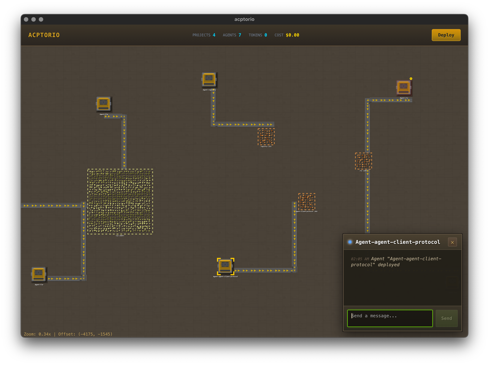

# acptorio

A Factorio-inspired desktop application for orchestrating AI coding agents via the Agent Client Protocol (ACP).



## Features

- Factory-style visualization of agents and projects
- Conveyor belt connections showing data flow
- Deploy and manage multiple AI agents
- Real-time status monitoring
- Animated belts when agents are working
- Project selection and management

## Tech Stack

- **Backend**: Tauri 2.0 (Rust)
- **Frontend**: React + TypeScript + Vite
- **State Management**: Zustand
- **Agent Protocol**: ACP (Agent Client Protocol)

## Development

```bash
npm install
npm run tauri dev
```

## Build

```bash
npm run tauri build
```

## Keyboard Shortcuts

- **E** - Deploy agent to selected project
- **Delete/Backspace** - Delete selected agents/projects
- **Ctrl+A** - Select all
- **Escape** - Clear selection
- **WASD/Arrows** - Pan the canvas
- **Scroll** - Zoom in/out
